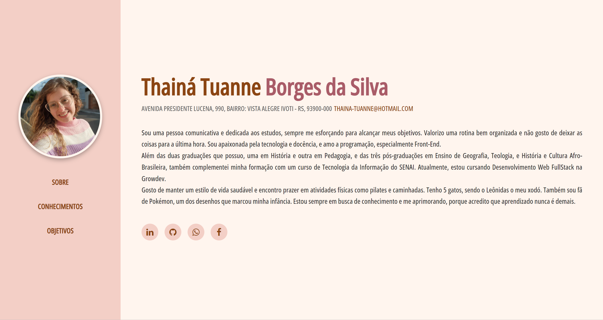
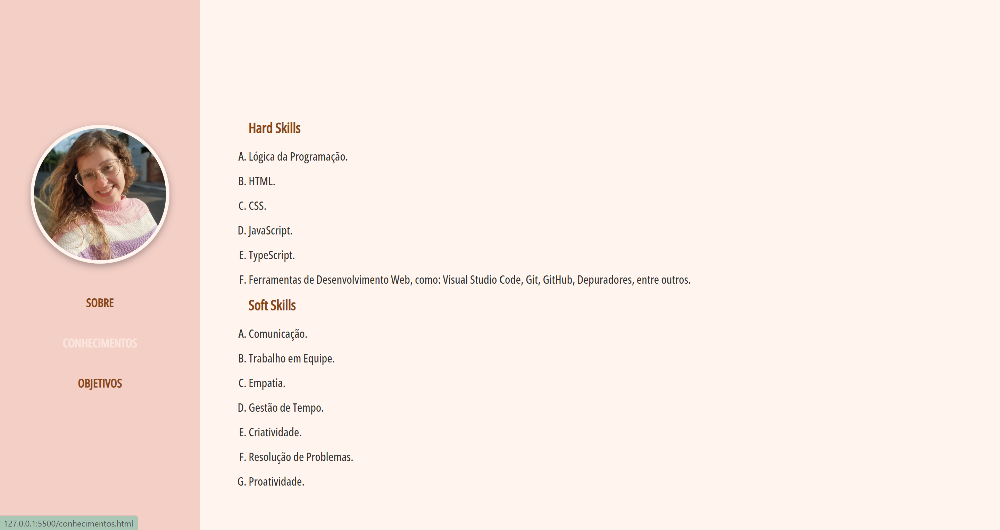
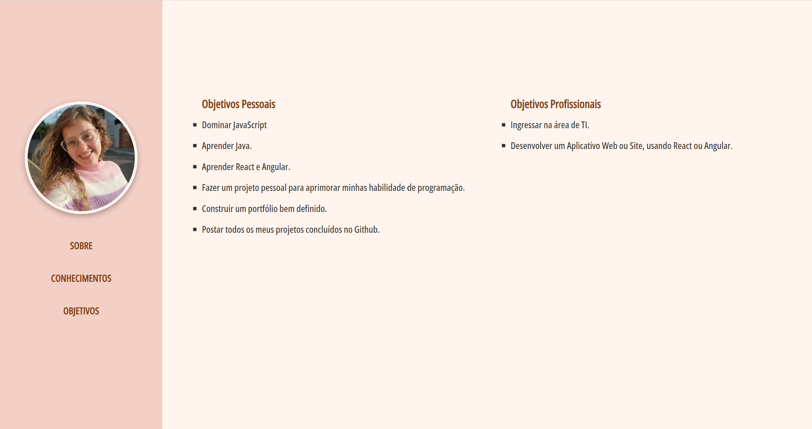

<h1>Módulo Front-end I - Avaliação Currículo Digital.</h1>

3 páginas html:
- index.html
- conhecimentos.html
- objetivos.html

 

1 pasta styles: 
- styles.css

 

 <h2>Página Index</h2>
 
 
 
  <h2>Página Conhecimentos</h2>
  

   
  
  <h2>Página Objetivos</h2>
  
